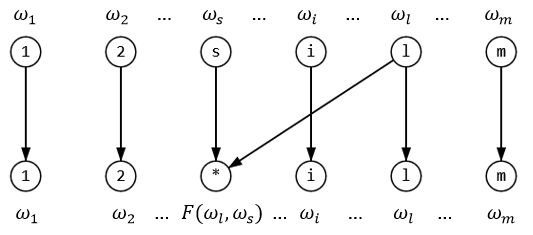
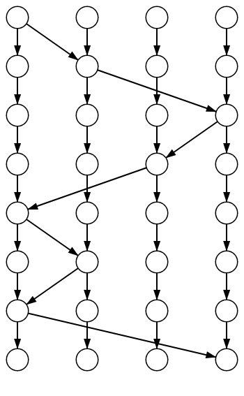

# Calculation of cryptographic characteristics for a cipher based on a generalized Feistel network

## Cipher Specification

$F:Z_2^n \times Z_2^n\to Z_2^n$ - bijective in the second variable function. $\omega_i \in Z_2^n\ (Z_{2^n})$ - words.

Round transformition $R^F[l,s]:Z_2^{mn} \to Z_2^{mn} $:

$R^F [l,s] (\omega_1,...,\omega_m)=(\omega_1,...,\omega_{s-1},F(\omega_l,\omega_s),\omega_{s+1},...,\omega_m) $



The composition $R^F[l_1,s_1]R^F[l_2,s_2]...R^F[l_h,s_h]$ implements substitution on the $nm$-bit block: $\Phi^F_N : Z_2^{nm}\to Z_2^{nm}$

Subtitution parameters: $n, m, h$, where $h$ - number of rounds (or *height*).
Network (sequence of pairs ($l$, $s$)) - also public parameter. The secret parameter is $F$ (tipical size $n$ - byte, so $n=8 $).

Example Network for 7 Rounds: $m=4,\ h=7$, and network $N=(1,2),(2,4),(4,3),(3,1),(1,2),(2,1),(1,4) $



## Experiment

1. This work considers networks only $(s_0, s_1), (s_1, s_2),..., (s_{i\ mod(m)}, s_{i+1\ mod(m)}),... = (1,2),(2,3),(3,4),... $
2. An equally probable choice of $F$ with the return from the set of all matrices whose rows are permutations (the cardinality of such a set is $(2^{n}!)^{2^{n}} \sim 2^{n2^{2n}}$).
3. Calculate MDP, AI, NL.

## Build

```bash
cd ~
git clone https://github.com/jmpleo/netcip-crypt-char.git
cd ~/netcip-crypt-char
```

### Research Build

1. You need `cmake` to build this porject.

   ```bash
   cd ~/netcip-crypt-char/netcip-research
   ```

   and run

   ```bash
   ./build.sh <N> <M> <H>
   ```
   or
   ```powershell
   cmake . -D__N=<N> -D__M=<M> -D__H=<H>
   cmake --build build
   ```

2. Build range configuration

   Linux:
   ```bash
   ./brut-build.sh
   ```

3. Run Computing

   For example, NL-computing:

   ```bash
   cd ~/netcip-crypt-char/netcip-research/stat
   ../bin/netcip-nl-<N>-<M>-<H>
   # saving in ./netstat-nl-<N>-<M>-<H>.csv
   ```

### Application Build

`crypto++` required:

```bash
sudo apt install libcrypto++-dev
```

```bash
cd ~/netcip-crypt-char/netcip-application
cmake -B build
cd build
make
```

after this tests and speedtest binaries created - run it:

```bash
~/netcip-crypt-char/netcip-application/bin/netcip-test
~/netcip-crypt-char/netcip-application/bin/netcip-speedtest
```

#### Speedtest:

- `Linux j 6.1.0-21-amd64 #1 SMP PREEMPT_DYNAMIC Debian 6.1.90-1 (2024-05-03) x86_64 GNU/Linux ` 
- `Intel Core i5-6200u`
- `crypto++ 8`

##### Block Size 8

| Cipher          | Blocks/Minute   |
|------------------|-----------------|
| **encrypt2_8x8** | **0.130471**    |
| **encrypt1_8x8** | **0.129512**    |
| RC5              | 0.113666        |
| Blowfish         | 0.0612267       |
| CAST-128         | 0.054692        |
| DES              | 0.0362695       |
| GOST             | 0.0327214       |
| RC2              | 0.0263849       |
| DES-EDE3         | 0.013939        |

##### Block Size 16

| Cipher          | Blocks/Minute   |
|------------------|-----------------|
| AES              | 0.198288        |
| **encrypt2_8x16** | **0.069381**    |
| **encrypt1_8x16** | **0.0610018**   |
| RC6              | 0.0491878       |
| MARS             | 0.03446         |
| Camellia         | 0.0344332       |
| CAST-256         | 0.0255286       |
| Serpent          | 0.0199389       |

##### Block Size 32

| Cipher                | Blocks/Minute   |
|------------------------|-----------------|
| Threefish-256(256)     | 0.0395069       |


## Founded

> Cherednik, I. V. On the use of binary operations for the construction of a multiply transitive class of block transformations / I. V. Cherednik // Discrete Mathematics and Applications.  2021.  31: 2. P. 91–111.) (Scopus, WoS) // https://www.mathnet.ru/rus/dm1597

